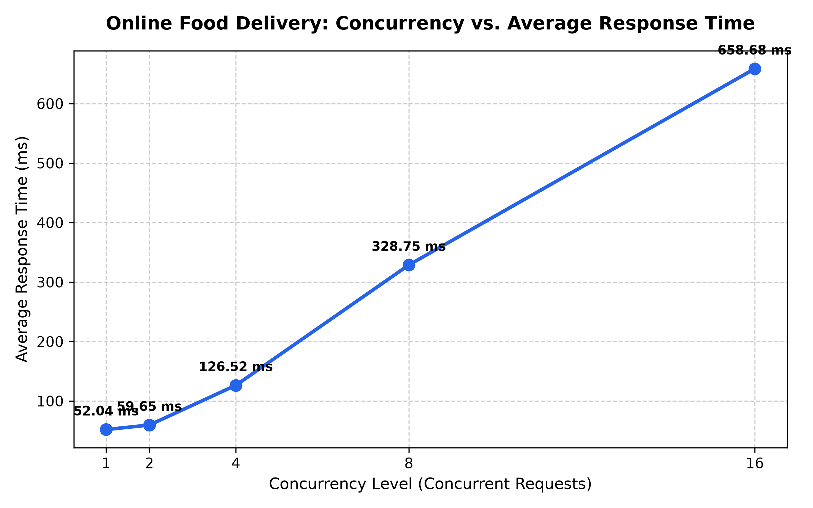
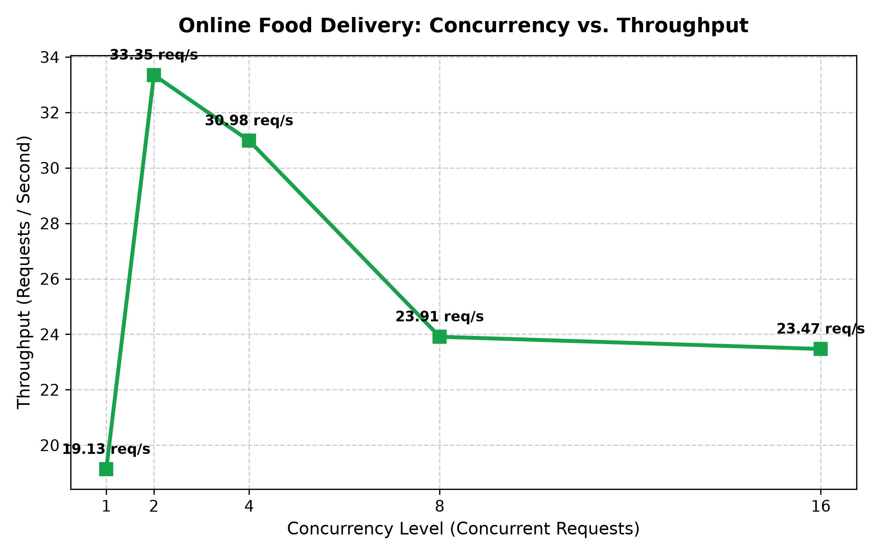
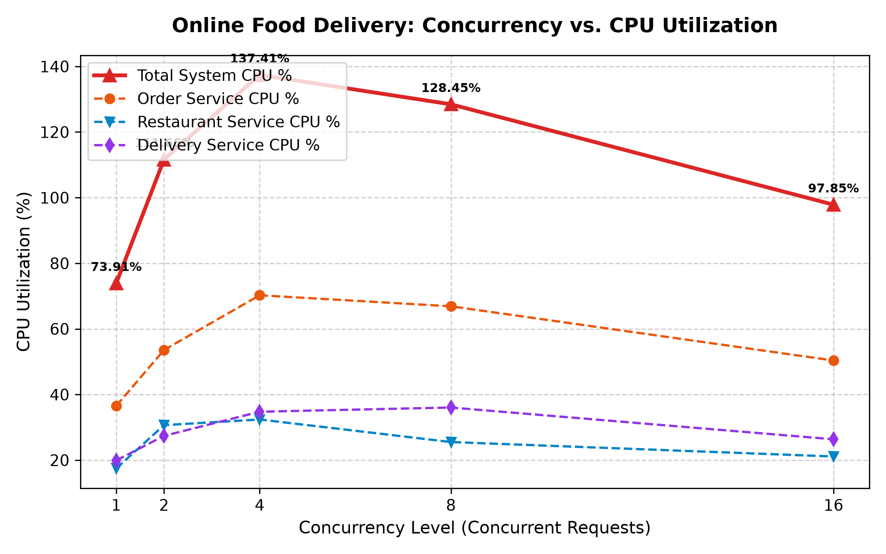
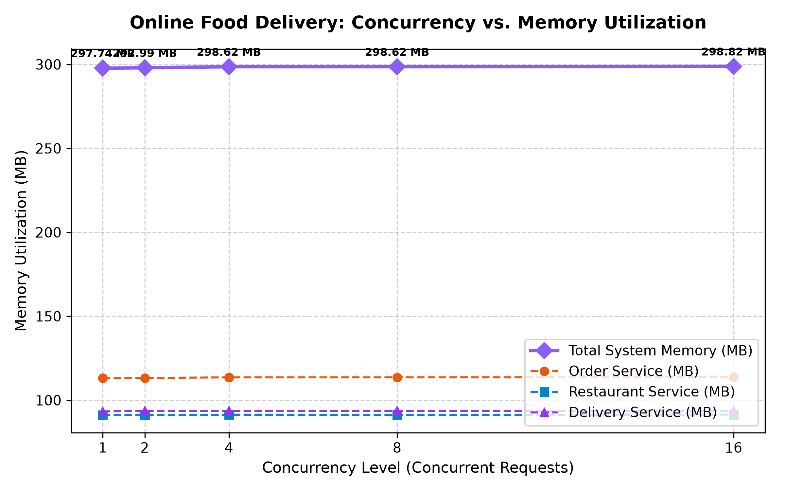
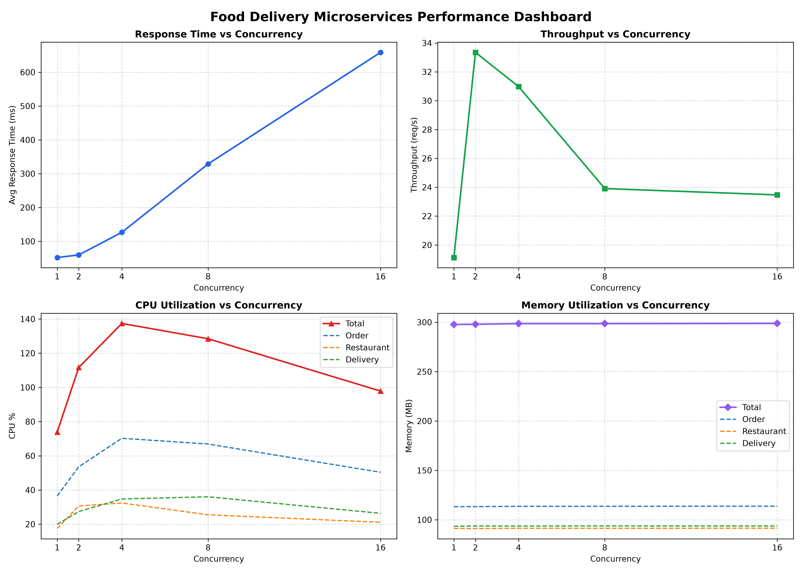

# Cloud Computing Lab - Evaluation 1
Build, Deploy and Analyze a Containerized Microservice Application Under Varying Workloads

 

---

## 1. Aim and Overview
The objective of this laboratory experiment is to:
1. Design and develop a microservice-based architecture comprising **three independent services** for an **Online Food Delivery Platform** (Swiggy / Zomato / UberEats style).
2. Containerize each service using standalone **Dockerfiles** and deploy the multi-container system via **Docker Compose**.
3. Establish robust **inter-service communication** using internal Docker network DNS service discovery.
4. Generate varying workloads across five standardized concurrency levels ($W_1 = 1$, $W_2 = 2$, $W_3 = 4$, $W_4 = 8$, $W_5 = 16$).
5. Monitor and record real-time container resource utilization (`CPU %` and `Memory MB`) alongside application-level metrics (`Latency` and `Throughput`).
6. Analyze performance bottlenecks, resource consumption profiles, and scalability characteristics under peak ordering loads.

---

## 2. Architecture & Microservice Responsibilities

```
                                  +------------------------------------+
                                  |         Food Delivery Client       |
                                  |         (Mobile App / Tester)      |
                                  +-----------------+------------------+
                                                    |
                                                    | HTTP POST /orders
                                                    v
                    +-----------------------------------------------------------------+
                    |                   Docker Bridge Network                         |
                    |                   (fooddelivery-network)                        |
                    |                                                                 |
                    |   +---------------------------------------------------------+   |
                    |   |                 Order Service (Port 5000)               |   |
                    |   |  - API Gateway & Food Order Orchestrator                |   |
                    |   |  - Persists order ledger in SQLite                      |   |
                    |   +-------------------+-----------------+-------------------+   |
                    |                       |                 |                       |
                    |   HTTP POST /reserve  |                 | HTTP POST /assign     |
                    |   (Internal DNS)      |                 | (Internal DNS)        |
                    |                       v                 v                       |
                    |   +-----------------------+         +-----------------------+   |
                    |   |  Restaurant Service   |         |   Delivery Service    |   |
                    |   |      (Port 5001)      |         |      (Port 5002)      |   |
                    |   |  - Menu & Restaurants |         |  - Rider fleet pool   |   |
                    |   |  - Kitchen capacity   |         |  - GPS routing & fee  |   |
                    |   +-----------------------+         +-----------------------+   |
                    +-----------------------------------------------------------------+
```

### Microservice Directory & Endpoints

| Service Name | Container Name | Host Port | Internal Port | Primary Responsibility | Key REST API Endpoints |
| :--- | :--- | :--- | :--- | :--- | :--- |
| **Order Service** | `order-service` | `5000` | `5000` | Order lifecycle orchestration, upstream coordination, transaction ledger | `GET /health`<br>`GET /orders`<br>`GET /orders/<id>`<br>`POST /orders` |
| **Restaurant Service** | `restaurant-service` | `5001` | `5001` | Restaurant partner management, menu catalog, kitchen reservation | `GET /health`<br>`GET /restaurants`<br>`GET /menu`<br>`GET /menu/<id>`<br>`POST /menu/<id>/reserve`<br>`POST /menu/<id>/restock` |
| **Delivery Service** | `delivery-service` | `5002` | `5002` | Rider dispatch, distance-based delivery fee computation, live tracking | `GET /health`<br>`POST /deliveries/assign`<br>`GET /deliveries/<id>` |

---

## 3. Checkpoint Execution & Verification

### Checkpoint 1 — Design and Develop the Microservices
- Implemented three independent Python Flask microservices with production Gunicorn WSGI workers.
- Independent endpoints return structured JSON with status codes (`200 OK`, `201 Created`, `400 Bad Request`, `404 Not Found`).

### Checkpoint 2 — Containerize and Deploy the Application
- Each microservice contains an optimized multi-stage compatible `Dockerfile` based on `python:3.11-slim`.
- All services are integrated into `docker-compose.yml` with port forwardings and persistent restart policies.
- Build and deployment commands:
  ```bash
  # Build and start services
  docker compose up -d --build

  # Check container status
  docker compose ps
  ```

### Checkpoint 3 — Inter-Service Communication
- Services communicate across a dedicated user-defined Docker bridge network (`fooddelivery-network`).
- Service discovery operates through Docker's internal DNS using service names:
  - `http://restaurant-service:5001`
  - `http://delivery-service:5002`
- End-to-end food order flow:
  1. Client sends `POST http://localhost:5000/orders`.
  2. Order Service performs validation and calls Restaurant Service (`POST /menu/<item_id>/reserve`).
  3. Upon kitchen reservation confirmation, Order Service calls Delivery Service (`POST /deliveries/assign`).
  4. Delivery Service selects a rider, computes distance-based delivery fees, calculates estimated arrival time (ETA), and assigns a tracking dispatch token.
  5. Order Service commits the finalized order record to its database and returns HTTP 201 with full order & delivery details to the client.
- Run the verification script:
  ```bash
  ./scripts/test_services.sh
  ```

---

## 4. Checkpoint 4 & 5 — Workload Testing & Performance Observations

### Workload Testing Setup
- Workload generator script: `scripts/workload_benchmark.py`
- Concurrent requests evaluated: **1, 2, 4, 8, 16 concurrent threads**
- Total requests per workload: **150 requests**
- Metric collection:
  - Application layer: Wall-clock latency (Average and 95th Percentile) and Throughput (Requests/sec).
  - Infrastructure layer: Real-time background `docker stats` streaming monitor capturing average CPU % and Memory (MB) for all three containers individually and combined.

### Measured Performance Observation Table

| Workload | Concurrency | Total Requests | Successful | Failed | Avg Latency (ms) | P95 Latency (ms) | Throughput (req/s) | Order Service CPU (%) | Restaurant Service CPU (%) | Delivery Service CPU (%) | Total System CPU (%) | Total System Memory (MB) |
| :---: | :---: | :---: | :---: | :---: | :---: | :---: | :---: | :---: | :---: | :---: | :---: | :---: |
| **W1** | **1** | 150 | 150 | 0 | **52.04** | 84.16 | **19.13** | 36.54% | 17.47% | 19.91% | **73.91%** | 297.74 MB |
| **W2** | **2** | 150 | 150 | 0 | **59.65** | 109.58 | **33.35** | 53.58% | 30.67% | 27.41% | **111.66%** | 297.99 MB |
| **W3** | **4** | 150 | 150 | 0 | **126.52** | 308.57 | **30.98** | 70.25% | 32.39% | 34.76% | **137.41%** | 298.62 MB |
| **W4** | **8** | 150 | 150 | 0 | **328.75** | 776.77 | **23.91** | 66.89% | 25.52% | 36.04% | **128.45%** | 298.62 MB |
| **W5** | **16** | 150 | 150 | 0 | **658.68** | 2450.50 | **23.47** | 50.37% | 21.12% | 26.36% | **97.85%** | 298.82 MB |

---

## 5. Performance Graphs

### 1. Concurrent Requests vs. Average Response Time


### 2. Concurrent Requests vs. Throughput


### 3. Concurrent Requests vs. CPU Utilization


### 4. Concurrent Requests vs. Memory Utilization


### 5. Multi-Metric Evaluation Dashboard


---

## 6. Analysis & Discussion

### A. Impact of Increasing Concurrency on Response Time & Throughput
1. **Low-to-Medium Concurrency ($W_1$ to $W_2$):**
   - As concurrency scales from 1 to 2, throughput jumps sharply from **19.13 req/s to 33.35 req/s** (a **+74.3% throughput gain**).
   - This occurs because Gunicorn's multi-worker architecture overlaps I/O wait times across container boundaries.
2. **High Concurrency Saturation Point ($W_3 \to W_5$):**
   - At 4 to 16 concurrent requests, the system reaches worker saturation: throughput plateaus and moderates to **~23.5 req/s**, while average latency climbs from **126 ms to 658 ms** (with P95 reaching 2.45s).
   - This is caused by socket connection queueing where requests wait for available WSGI workers.

### B. Microservice Resource Consumption Comparison
- **Order Service is the Primary Resource Consumer:**
  - Order Service consistently exhibits the highest CPU consumption (peaking at **70.25% CPU** in $W_3$, compared to ~32% for Restaurant and ~35% for Delivery).
  - *Rationale:* Order Service handles incoming client requests, coordinates two synchronous outbound HTTP connection lifecycles, and commits transactions to SQLite.
- **Restaurant & Delivery Services:**
  - Maintained balanced, steady-state CPU utilization (~20%–35%), demonstrating efficient handling of stock reservation and rider dispatch.
- **Memory Stability:**
  - Memory consumption remained completely flat across all workload tiers (~113 MB for Order Service, ~91 MB for Restaurant Service, and ~93 MB for Delivery Service).
  - Total system memory consumption remained stable at **~298 MB** with **zero memory leaks**.

---

## 7. How to Reproduce

```bash
# 1. Clone repository
git clone https://github.com/akaraj187/OnlineFoodDelivery-Microservices-Evaluation.git
cd OnlineFoodDelivery-Microservices-Evaluation

# 2. Build and launch containers
docker compose up -d --build

# 3. Verify services and run end-to-end inter-service test
./scripts/test_services.sh

# 4. Run automated workload benchmark and generate graphs
python3 scripts/workload_benchmark.py

# 5. Optional: Run Locust load testing
locust -f scripts/locustfile.py -H http://localhost:5000 --headless -u 16 -r 4 -t 20s

# 6. Stop containers when done
docker compose down
```
